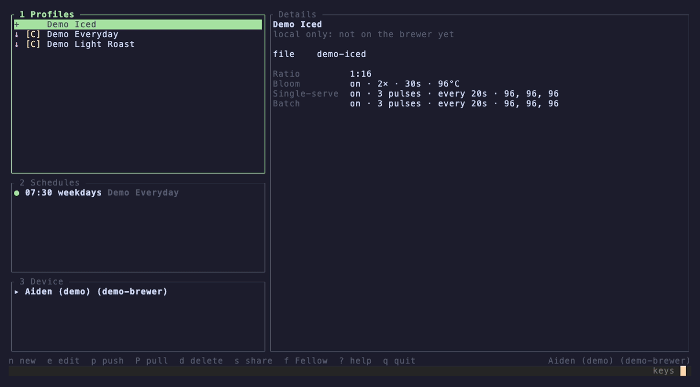
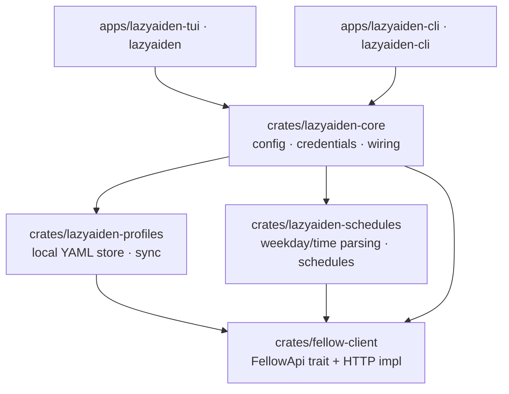

# lazyaiden

An unofficial terminal tool for the **Fellow Aiden** coffee brewer, in Rust.

> **Unofficial.** Fellow publishes no public API. Everything here is built on the endpoints used by the
> official mobile app, as documented by the community projects
> [`9b/fellow-aiden`](https://github.com/9b/fellow-aiden),
> [`simmerkaer/fellow-aiden-ts`](https://github.com/simmerkaer/fellow-aiden-ts) and
> [`simmerkaer/fellow-aiden-dotnet`](https://github.com/simmerkaer/fellow-aiden-dotnet). It can break
> whenever Fellow changes its backend, and using it may conflict with Fellow's terms of service. Use at your
> own risk.
>
> This project is not affiliated with, endorsed by or sponsored by Fellow Industries, Inc. "Fellow" and
> "Aiden" are trademarks of their owner and are used here only to describe which brewer the tool works with.

## Features



* **LazyGit-style TUI (`lazyaiden`)**: panels for profiles, schedules and brewers, a details pane with a
  local-vs-brewer diff, form editing with live validation, or `$EDITOR` for the raw YAML.
* **Headless CLI (`lazyaiden-cli`)**: the same features for scripts and automation, with `--json` output, stable
  exit codes, shell completions and man pages.
* **Profiles as YAML files**: edit them with any editor, keep them in git, and push to the brewer only when you
  want. Sync state is shown per profile (in sync, modified, local only, on the brewer only).
* **Profile from a coffee bag**: an agent skill in
  [`.claude/skills/aiden-profile-from-bag`](.claude/skills/aiden-profile-from-bag) turns a photo of the bag or
  the roaster's product page into a validated profile, and tunes it from taste feedback (sour, bitter, flat...).
  Push the result with `lazyaiden-cli profile add -i <file> && lazyaiden-cli profile push <name>`.
* **Schedules**: create, toggle and delete recurring brews (`--days mon-fri --time 7:30am`).
* **Sharing**: create share links (copied to the clipboard in the TUI) and import profiles from links.
* **Fellow vs. your profiles**: Fellow's built-in profiles are tagged `[F]` and hidden by default; yours are `[C]`.
* **Demo mode**: `--demo` runs everything offline against sample data in a throwaway directory, no account
  needed; your real profiles and config are left untouched. Pass `--profiles-dir` to keep the demo's local
  profiles between runs (e.g. to try the TUI and the CLI on the same files).

## Install

### Homebrew (macOS and Linux)

```bash
brew install mohammadalijf/tap/lazyaiden
```

This taps [mohammadalijf/homebrew-tap](https://github.com/mohammadalijf/homebrew-tap) and installs:

* `lazyaiden`, the TUI, and `lazyaiden-cli`, the headless CLI;
* man pages: `man lazyaiden`, `man lazyaiden-cli`, and one per subcommand (`man lazyaiden-cli-profile-push`);
* bash, zsh and fish completions for both commands (see
  [Homebrew's shell completion docs](https://docs.brew.sh/Shell-Completion) if zsh doesn't pick them up).

Keep it up to date with the rest of your Homebrew packages:

```bash
brew upgrade lazyaiden
```

Release candidates are published as a separate, opt-in formula. It conflicts with the stable one, so
uninstall that first:

```bash
brew uninstall lazyaiden && brew install mohammadalijf/tap/lazyaiden-rc
```

### Pre-built archives

Every [GitHub release](https://github.com/mohammadalijf/lazyaiden/releases) has a
`lazyaiden-vX.Y.Z-<target>.tar.gz` for macOS and Linux on arm64 and x86_64, with both binaries, the man
pages and the completions, plus a `.sha256` checksum. Put the binaries on your `PATH` and the `man/` pages
in a `man1` directory on your `MANPATH`.

### From source

Needs Rust 1.88+ (see [Requirements](#requirements)):

```bash
cargo install --git https://github.com/mohammadalijf/lazyaiden lazyaiden-tui lazyaiden-cli
lazyaiden-cli man --dir ~/.cargo/share/man/man1   # optional: man pages for the CLI
```

## Quick start

```bash
# Try everything without an account (offline, sample data, state is lost on exit)
lazyaiden --demo
lazyaiden-cli --demo profile list

# Real account: store credentials once (verified, then kept in the OS keychain)
lazyaiden-cli login

lazyaiden-cli profile list                    # local + remote, with sync state
lazyaiden-cli profile add -i profile.yaml     # headless import (use -i - for stdin)
lazyaiden-cli profile push --all              # create/update on the brewer, never duplicates
lazyaiden-cli schedule add --profile "Morning V60" --days mon-fri --time 7:30am --water 500
lazyaiden                                     # the TUI
```

Credentials can also come from `FELLOW_EMAIL` and `FELLOW_PASSWORD`, which win over the keychain; handy for
scripts and CI.

## Workspace



| Crate | Role |
| --- | --- |
| [`fellow-client`](crates/fellow-client) | The **protocol** (`FellowApi` trait), models with validation, the default `HttpFellowClient`, and an in-memory fake for tests. |
| [`lazyaiden-profiles`](crates/lazyaiden-profiles) | Business logic for profiles: YAML store, import/export, status/diff, push/pull. Receives the protocol by injection. |
| [`lazyaiden-schedules`](crates/lazyaiden-schedules) | Business logic for schedules and the `mon-fri` / `7:30am` parsers. Receives the protocol by injection. |
| [`lazyaiden-core`](crates/lazyaiden-core) | Composition root: config, credentials, brewer selection, builds the services. The only place that constructs the HTTP client. |
| [`lazyaiden-cli`](apps/lazyaiden-cli) | Headless front end (`lazyaiden-cli`). |
| [`lazyaiden-tui`](apps/lazyaiden-tui) | Terminal UI (`lazyaiden`). |

The apps never touch the client directly; they ask `lazyaiden-core` for services. See
[docs/architecture.md](docs/architecture.md).

## Documentation

* [Architecture](docs/architecture.md): layering, dependency injection, how to add a backend
* [Profile format](docs/profile-format.md): the YAML schema, allowed values, git workflow
* [CLI reference](docs/cli.md): every command, JSON output, exit codes
* [TUI guide](docs/tui.md): panels, key map, brewer picker
* [Fellow API notes](docs/fellow-api.md): the reverse-engineered endpoints and shapes
* [Development](docs/development.md): tests, fixtures, snapshots, adding endpoints

## Configuration

`flag > environment variable > config file > default`

| Setting | Flag | Environment | Config key | Default |
| --- | --- | --- | --- | --- |
| Config file | `--config` | `LAZYAIDEN_CONFIG` | | `$XDG_CONFIG_HOME/lazyaiden/config.toml` or `~/.config/lazyaiden/config.toml` |
| Profiles directory | `--profiles-dir` | `LAZYAIDEN_PROFILES_DIR` | `profiles_dir` | `profiles/` next to the config file |
| Active brewer | `--brewer` | `LAZYAIDEN_BREWER_ID` | `brewer_id` | auto when there is exactly one |
| API base URL | `--base-url` (cli) | `LAZYAIDEN_BASE_URL` | `base_url` | Fellow's production endpoint |

Credentials: `FELLOW_EMAIL` + `FELLOW_PASSWORD` first, then the OS keychain (`lazyaiden-cli login`).

## Requirements

Rust 1.88+ (edition 2024). On Linux the keychain uses the Secret Service (D-Bus): install `libdbus-1-dev`
to build and run a Secret Service provider (e.g. GNOME Keyring); without one, use the environment variables.

## License

MIT. Fellow and Aiden are trademarks of Fellow Industries, Inc.; see the notice at the top.
